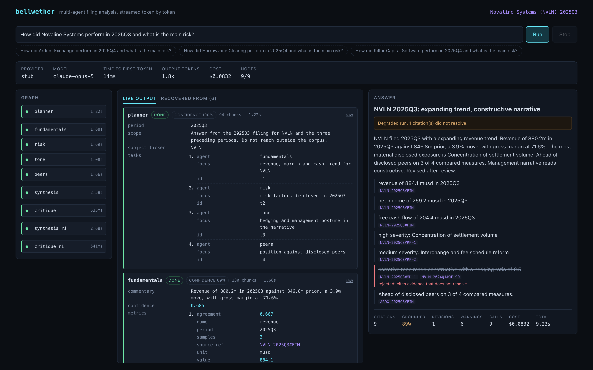

# Bellwether

A multi-agent analysis engine that streams token by token into a React console,
and a determinism layer that makes the whole thing testable.

Ask a question about a quarterly filing. A planner decides which specialists
should look at it, four of them fan out in parallel over different slices of the
document, a synthesiser writes the answer, and a critic checks every claim
against the evidence it cites and can send the answer back to be rewritten.
Every token from every agent streams to the browser as it is generated.

The interesting problem is not the agent graph. It is that a system built on a
model is nondeterministic, and nondeterministic systems are hard to trust and
harder to test. Most of the code here is about that: constrained output with a
repair turn rather than a blind retry, self-consistency sampling on the numbers,
a citation check that is decided by lookup instead of by judgement, a bounded
revision loop, and record-replay so a run can be reproduced exactly.

> **Runs offline, with no API key.** The default provider is a deterministic
> stub that synthesises grounded answers from the same corpus the real agents
> read, and injects schema violations, broken citations, sample disagreement and
> transport failures at a seeded rate. Every number in this README was measured
> against it. See [Status](#status) for what that does and does not tell you.

```
git clone https://github.com/maisymylod/bellwether && cd bellwether
make setup
make demo          # one run, printed to the terminal
make api & make web   # the console on http://localhost:5273
```

## The console



Left, the agent graph, drawn from the first event before anything has run.
`synthesis r1` and `critique r1` at the bottom were not in that graph: the critic
added them at runtime after rejecting a claim.

Middle, each agent's output as it arrives. Generation is constrained to a JSON
schema, so what streams over the wire is JSON, and the console parses the prefix
on every frame rather than waiting for the closing brace. Fields appear as they
land. The tab beside it lists everything the run had to recover from.

Right, the delivered answer. The struck-through point cites
`NVLN-2024Q1#RF-99`, which does not exist in the corpus. The critic caught it,
sent the synthesiser back once, and the rewrite still could not evidence it, so
it is reported struck through with the reason rather than quietly deleted. The
run is labelled degraded and the grounding rate reads 89 percent.

## How it fits together

```
  browser                                       engine
 ┌──────────────────────────────┐    SSE     ┌──────────────────────────────────┐
 │ React 19 + TypeScript + Vite │ <========= │ FastAPI            :8788         │
 │                              │  id: seq   │                                  │
 │  stream.ts   one dispatch    │  Last-     │  scheduler   dynamic DAG,        │
 │              per animation   │  Event-ID  │              parallel fan-out,   │
 │              frame, not      │  resume    │              cancellation        │
 │              per token       │            │                                  │
 │  partialJson.ts  renders an  │            │  robust      retry vs repair     │
 │              unfinished      │            │  consensus   median of n samples │
 │              JSON object     │            │  critic      citation lookup     │
 │  reducer.ts  pure fold over  │            │                                  │
 │              the event log   │            │  providers   stub | replay |     │
 └──────────────────────────────┘            │              record | anthropic  │
                                             └──────────────────────────────────┘
                                                            |
                                                    Claude, constrained to
                                                    each agent's JSON schema
```

The agent graph:

```
                       ┌──────────────┐
                       │   planner    │   decides who looks at what
                       └──────┬───────┘
             ┌────────────┬───┴────────┬────────────┐
             ▼            ▼            ▼            ▼
      ┌────────────┐┌──────────┐┌──────────┐┌──────────────┐
      │fundamentals││   risk   ││   tone   ││    peers     │   parallel
      │  n=3 vote  ││          ││          ││              │
      └────────────┘└─────┬────┘└────┬─────┘└──────┬───────┘
                          └──────────┼────────────┘
                                     ▼
                             ┌───────────────┐
                             │  synthesis    │
                             └───────┬───────┘
                                     ▼
                             ┌───────────────┐      unsupported claim
                             │   critique    │───────────────┐
                             └───────┬───────┘               │
                                 accept                      ▼
                                     │              ┌────────────────┐
                                     ▼              │ synthesis @r1  │
                                  report            │ critique  @r1  │
                                                    └────────────────┘
```

A dependency is a wait, not a requirement. A node runs once its dependencies
reach a terminal state, whether or not they succeeded, so one specialist dying
narrows the answer instead of cancelling it. The synthesiser is told which
specialists did not return and instructed to say so.

## Making a nondeterministic system testable

Four failure modes, four different answers. They are separated because the
common mistake is treating them as one.

**A call fails.** Retry with backoff, bounded. Nothing clever.

**The output violates the schema.** Do not retry. A retry re-rolls the dice and
usually loses again. Hand back the validator's own error, quote the offending
response, and ask for a correction. Repairs and retries are counted separately,
because the ratio between them is the number worth watching.

**The model disagrees with itself.** Only a problem for the figures, so only the
fundamentals agent pays for it: three samples, median-reduced, with an agreement
score attached. Samples run concurrently, so it costs tokens, not wall clock.

**The model makes something up.** Every schema that carries a claim requires a
`source_ref`, and every piece of evidence in the corpus has a stable id
(`NVLN-2025Q3#RF-2`). So the first half of the check is a dictionary lookup: a
citation either resolves or it does not, no model call, no flakiness. The second
half is the part code cannot do, which is whether a citation that resolves
actually says what the claim says, and that goes to the model with the resolved
text in front of it. When either half rejects a point, the critic schedules a
revision. Revisions are capped, because a critic and a writer left alone will
argue indefinitely.

### The offline provider is hostile on purpose

A stub that always returned clean output would make all of the above look like
it works while proving nothing. This one injects, at a seeded rate: schema
violations, citations that resolve to nothing, numeric outliers, and mid-stream
transport failures. Turn the rates to zero and the eval metrics hit their
ceilings. Turn them to one and the run degrades and says so. Both are asserted
in the test suite.

That is what makes the eval gate mean something in CI with no API key.

## Measured

`make gate` runs 18 golden cases derived from the corpus, at the default fault
rate, and fails the build if a threshold is breached. Ground truth is arithmetic
computed from the same JSON the agents read, so it cannot drift away from the
data.

| Metric | Measured (n=3, six base seeds) | CI floor |
| --- | --- | --- |
| Completion rate | 1.000 | 1.000 |
| Grounding rate (citations that resolve) | 0.962 - 0.982 | 0.940 |
| Numeric accuracy (within 2% of truth) | 0.900 - 0.956 | 0.880 |
| Contradiction rate (claims the critic rejected) | 0.024 - 0.048 | 0.080 |
| Schema failure rate (runs with no answer) | 0.000 | 0.020 |

The floors sit under the worst value observed, so the gate catches a regression
rather than the ordinary spread.

**What self-consistency buys** (`make sweep`, five base seeds each):

| Samples | Numeric accuracy | Cost per run | vs one sample |
| --- | --- | --- | --- |
| 1 | 0.871 | $0.0572 | - |
| 3 | 0.929 | $0.0747 | +31% |
| 5 | 0.980 | $0.0917 | +60% |
| 7 | 0.982 | $0.1085 | +90% |

Three is the default. Five is worth it if the figures matter more than the bill.
Seven is not.

**What the revision loop buys.** With every citation deliberately broken, so the
critic has something to find on every run:

| | Grounding rate | Contradiction rate | Cost per run |
| --- | --- | --- | --- |
| No revisions | 0.652 | 0.429 | $0.0660 |
| One revision | 0.735 | 0.325 | $0.0859 |

It does not get to 1.0, and it should not: a second pass fixes some of what the
first got wrong and reports the rest. The run that ends still carrying a rejected
claim says so on its face.

## Streaming

Two problems, at opposite ends of the connection.

**The server has to be resumable.** Every SSE frame carries `id: <seq>`, which
the browser hands back as `Last-Event-ID` on reconnect with no client
bookkeeping. Each run keeps an append-only event log, so a reconnect replays the
tail and a client that attaches halfway through a run gets the whole thing
backfilled and renders identically to one that was there from the start. If the
resume point has been evicted from the buffer, the engine returns 409 rather
than serving a stream with a hole in it.

**The client has to survive the volume.** A run emits on the order of a thousand
events, most of them single tokens, in bursts. Dispatching each into React state
is a render per token, and the UI goes to treacle exactly when there is most to
look at. Events are buffered and flushed once per animation frame instead, so
the render count is bounded by the display rather than by the model. Everything
downstream of the socket takes an array of events for this reason, including the
reducer.

**Rendering unfinished JSON.** Because generation is schema-constrained, what
streams is JSON, and waiting for the closing brace throws away the point of
streaming. `partialJson.ts` repairs a prefix into the smallest valid document
that could complete it: unterminated strings closed, dangling commas and
half-written keys dropped, open containers closed. It never guesses at a value,
so an incomplete number is dropped rather than rounded to whatever has arrived.
That means a field can briefly vanish, which is correct and looks awful, so the
reducer folds each parse into the last one and renders the merge. The view only
ever gains detail.

Both properties are covered by unit tests over every prefix of a real payload.

## Layout

```
engine/bellwether
  events.py           the wire protocol, mirrored in TypeScript
  run.py              builds the graph, runs it, assembles the report
  agents/             planner, four specialists, synthesiser, critic
    schemas.py        the JSON schemas, and the source_ref requirement
    prompts.py        prompt text, versioned on its own
  runtime/
    scheduler.py      dynamic DAG, parallel fan-out, cancellation
    robust.py         retry vs repair, schema validation
    consensus.py      median over n samples, with an agreement score
    blackboard.py     shared state and the replayable event log
    budget.py         token and cost ceiling, checked before a call
  providers/
    stub.py           deterministic, offline, hostile on purpose
    cassette.py       record and replay a live run
    claude.py         the live provider
  eval/               golden set, metrics, CI gate
  corpus/             synthetic filings, and the generator that made them

web/src
  lib/partialJson.ts  renders JSON that has not finished arriving
  lib/stream.ts       SSE client, one dispatch per animation frame
  lib/reducer.ts      pure fold over the event stream
  lib/events.ts       the TypeScript half of the protocol
  components/         graph, per-agent lanes, answer, warnings
```

## Providers

Set `BELLWETHER_PROVIDER`:

| | Network | Key | Deterministic | Use |
| --- | --- | --- | --- | --- |
| `stub` | no | no | yes | default; demos, tests, the eval gate |
| `replay` | no | no | yes | replay a recorded live run exactly |
| `record` | yes | yes | no | call the API and write cassettes |
| `anthropic` | yes | yes | no | live |

Nothing above the provider interface changes between them. The live provider
constrains generation to the same schemas the runtime validates against, because
a constraint enforced only server-side is a constraint you cannot test.

## Status

Built and green: the graph, the streaming, the determinism layer, the eval
harness and its CI gate, and the console.

**Not run against the live API.** Everything reported here was measured on the
offline provider. That is a real measurement of the recovery machinery under a
known fault rate, and it is not a measurement of Claude: the stub's error modes
are the ones I chose to inject, at rates I chose. The live path is written and
type-checked but has never issued a request, and no numbers are quoted for it
rather than plausible ones being invented. To close that gap:

```
export ANTHROPIC_API_KEY=...
BELLWETHER_PROVIDER=record make demo    # writes cassettes
BELLWETHER_PROVIDER=replay make gate    # the same gate, on real output
```

The eval harness is the same either way, so the recorded run can be scored
against the same thresholds and the two columns compared.

Other known limits. The corpus is six invented companies over four quarters,
which is enough to make the citation check and the arithmetic ground truth real
but is not a retrieval problem; there is no index and no ranking, and a
production version would need both. The critic's semantic half is a single call
with no cross-checking against the specialists' raw findings. Cost is estimated
from published per-token rates rather than read from billing.

## Tests

136 of them: 86 in the engine, 50 in the console. CI runs ruff, `mypy --strict`,
pytest, the eval gate, the sampling sweep, eslint, `tsc`, vitest, and the
production build. No step needs a network or a key.
